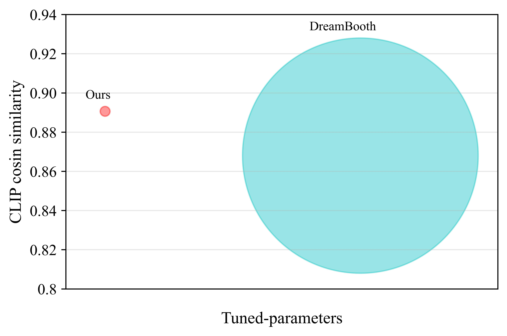
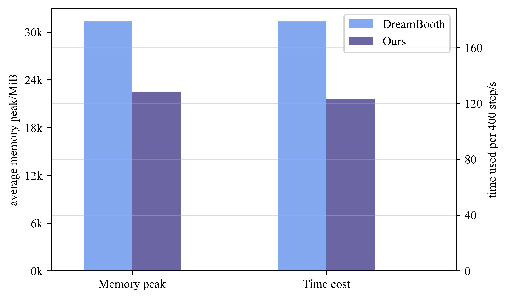
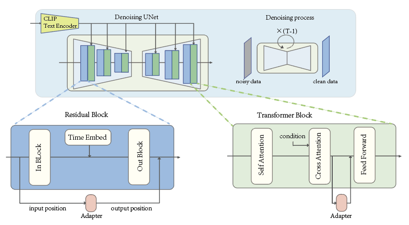
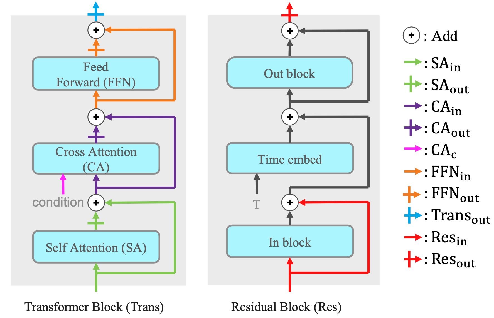
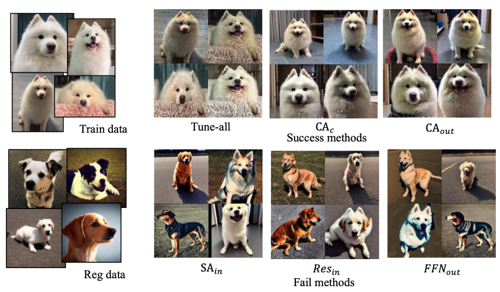

# Stable Diffusion
*Stable Diffusion was made possible thanks to a collaboration with [Stability AI](https://stability.ai/) and [Runway](https://runwayml.com/) and builds upon our previous work:*

[**High-Resolution Image Synthesis with Latent Diffusion Models**](https://ommer-lab.com/research/latent-diffusion-models/)<br/>
[Robin Rombach](https://github.com/rromb)\*,
[Andreas Blattmann](https://github.com/ablattmann)\*,
[Dominik Lorenz](https://github.com/qp-qp)\,
[Patrick Esser](https://github.com/pesser),
[Björn Ommer](https://hci.iwr.uni-heidelberg.de/Staff/bommer)<br/>
_[CVPR '22 Oral](https://openaccess.thecvf.com/content/CVPR2022/html/Rombach_High-Resolution_Image_Synthesis_With_Latent_Diffusion_Models_CVPR_2022_paper.html) |
[GitHub](https://github.com/CompVis/latent-diffusion) | [arXiv](https://arxiv.org/abs/2112.10752) | [Project page](https://ommer-lab.com/research/latent-diffusion-models/)_


[Stable Diffusion](#stable-diffusion-v1) is a latent text-to-image diffusion
model.
Thanks to a generous compute donation from [Stability AI](https://stability.ai/) and support from [LAION](https://laion.ai/), we were able to train a Latent Diffusion Model on 512x512 images from a subset of the [LAION-5B](https://laion.ai/blog/laion-5b/) database. 
Similar to Google's [Imagen](https://arxiv.org/abs/2205.11487), 
this model uses a frozen CLIP ViT-L/14 text encoder to condition the model on text prompts.
With its 860M UNet and 123M text encoder, the model is relatively lightweight and runs on a GPU with at least 10GB VRAM.
See [this section](#stable-diffusion-v1) below and the [model card](https://huggingface.co/CompVis/stable-diffusion).

  
## Requirements
A suitable [conda](https://conda.io/) environment named `ldm` can be created
and activated with:

```
conda env create -f environment.yaml
conda activate ldm
```

You can also update an existing [latent diffusion](https://github.com/CompVis/latent-diffusion) environment by running

```
conda install pytorch torchvision -c pytorch
pip install transformers==4.19.2 diffusers invisible-watermark
pip install -e .
``` 


## Stable Diffusion v1

Stable Diffusion v1 refers to a specific configuration of the model
architecture that uses a downsampling-factor 8 autoencoder with an 860M UNet
and CLIP ViT-L/14 text encoder for the diffusion model. The model was pretrained on 256x256 images and 
then finetuned on 512x512 images.

*Note: Stable Diffusion v1 is a general text-to-image diffusion model and therefore mirrors biases and (mis-)conceptions that are present
in its training data. 
Details on the training procedure and data, as well as the intended use of the model can be found in the corresponding [model card](Stable_Diffusion_v1_Model_Card.md).*

The weights are available via [the CompVis organization at Hugging Face](https://huggingface.co/CompVis) under [a license which contains specific use-based restrictions to prevent misuse and harm as informed by the model card, but otherwise remains permissive](LICENSE). While commercial use is permitted under the terms of the license, **we do not recommend using the provided weights for services or products without additional safety mechanisms and considerations**, since there are [known limitations and biases](Stable_Diffusion_v1_Model_Card.md#limitations-and-bias) of the weights, and research on safe and ethical deployment of general text-to-image models is an ongoing effort. **The weights are research artifacts and should be treated as such.**

[The CreativeML OpenRAIL M license](LICENSE) is an [Open RAIL M license](https://www.licenses.ai/blog/2022/8/18/naming-convention-of-responsible-ai-licenses), adapted from the work that [BigScience](https://bigscience.huggingface.co/) and [the RAIL Initiative](https://www.licenses.ai/) are jointly carrying in the area of responsible AI licensing. See also [the article about the BLOOM Open RAIL license](https://bigscience.huggingface.co/blog/the-bigscience-rail-license) on which our license is based.

### Weights

We currently provide the following checkpoints:

- `sd-v1-1.ckpt`: 237k steps at resolution `256x256` on [laion2B-en](https://huggingface.co/datasets/laion/laion2B-en).
  194k steps at resolution `512x512` on [laion-high-resolution](https://huggingface.co/datasets/laion/laion-high-resolution) (170M examples from LAION-5B with resolution `>= 1024x1024`).
- `sd-v1-2.ckpt`: Resumed from `sd-v1-1.ckpt`.
  515k steps at resolution `512x512` on [laion-aesthetics v2 5+](https://laion.ai/blog/laion-aesthetics/) (a subset of laion2B-en with estimated aesthetics score `> 5.0`, and additionally
filtered to images with an original size `>= 512x512`, and an estimated watermark probability `< 0.5`. The watermark estimate is from the [LAION-5B](https://laion.ai/blog/laion-5b/) metadata, the aesthetics score is estimated using the [LAION-Aesthetics Predictor V2](https://github.com/christophschuhmann/improved-aesthetic-predictor)).
- `sd-v1-3.ckpt`: Resumed from `sd-v1-2.ckpt`. 195k steps at resolution `512x512` on "laion-aesthetics v2 5+" and 10\% dropping of the text-conditioning to improve [classifier-free guidance sampling](https://arxiv.org/abs/2207.12598).
- `sd-v1-4.ckpt`: Resumed from `sd-v1-2.ckpt`. 225k steps at resolution `512x512` on "laion-aesthetics v2 5+" and 10\% dropping of the text-conditioning to improve [classifier-free guidance sampling](https://arxiv.org/abs/2207.12598).

Evaluations with different classifier-free guidance scales (1.5, 2.0, 3.0, 4.0,
5.0, 6.0, 7.0, 8.0) and 50 PLMS sampling
steps show the relative improvements of the checkpoints:


### Text-to-Image with Stable Diffusion


Stable Diffusion is a latent diffusion model conditioned on the (non-pooled) text embeddings of a CLIP ViT-L/14 text encoder.
We provide a [reference script for sampling](#reference-sampling-script), but
there also exists a [diffusers integration](#diffusers-integration), which we
expect to see more active community development.

#### Reference Sampling Script

We provide a reference sampling script, which incorporates

- a [Safety Checker Module](https://github.com/CompVis/stable-diffusion/pull/36),
  to reduce the probability of explicit outputs,
- an [invisible watermarking](https://github.com/ShieldMnt/invisible-watermark)
  of the outputs, to help viewers [identify the images as machine-generated](scripts/tests/test_watermark.py).

After [obtaining the `stable-diffusion-v1-*-original` weights](#weights), link them
```
mkdir -p models/ldm/stable-diffusion-v1/
ln -s <path/to/model.ckpt> models/ldm/stable-diffusion-v1/model.ckpt 
```
and sample with
```
python scripts/txt2img.py --prompt "a photograph of an astronaut riding a horse" --plms 
```

By default, this uses a guidance scale of `--scale 7.5`, [Katherine Crowson's implementation](https://github.com/CompVis/latent-diffusion/pull/51) of the [PLMS](https://arxiv.org/abs/2202.09778) sampler, 
and renders images of size 512x512 (which it was trained on) in 50 steps. All supported arguments are listed below (type `python scripts/txt2img.py --help`).


```commandline
usage: txt2img.py [-h] [--prompt [PROMPT]] [--outdir [OUTDIR]] [--skip_grid] [--skip_save] [--ddim_steps DDIM_STEPS] [--plms] [--laion400m] [--fixed_code] [--ddim_eta DDIM_ETA]
                  [--n_iter N_ITER] [--H H] [--W W] [--C C] [--f F] [--n_samples N_SAMPLES] [--n_rows N_ROWS] [--scale SCALE] [--from-file FROM_FILE] [--config CONFIG] [--ckpt CKPT]
                  [--seed SEED] [--precision {full,autocast}]

optional arguments:
  -h, --help            show this help message and exit
  --prompt [PROMPT]     the prompt to render
  --outdir [OUTDIR]     dir to write results to
  --skip_grid           do not save a grid, only individual samples. Helpful when evaluating lots of samples
  --skip_save           do not save individual samples. For speed measurements.
  --ddim_steps DDIM_STEPS
                        number of ddim sampling steps
  --plms                use plms sampling
  --laion400m           uses the LAION400M model
  --fixed_code          if enabled, uses the same starting code across samples
  --ddim_eta DDIM_ETA   ddim eta (eta=0.0 corresponds to deterministic sampling
  --n_iter N_ITER       sample this often
  --H H                 image height, in pixel space
  --W W                 image width, in pixel space
  --C C                 latent channels
  --f F                 downsampling factor
  --n_samples N_SAMPLES
                        how many samples to produce for each given prompt. A.k.a. batch size
  --n_rows N_ROWS       rows in the grid (default: n_samples)
  --scale SCALE         unconditional guidance scale: eps = eps(x, empty) + scale * (eps(x, cond) - eps(x, empty))
  --from-file FROM_FILE
                        if specified, load prompts from this file
  --config CONFIG       path to config which constructs model
  --ckpt CKPT           path to checkpoint of model
  --seed SEED           the seed (for reproducible sampling)
  --precision {full,autocast}
                        evaluate at this precision
```
Note: The inference config for all v1 versions is designed to be used with EMA-only checkpoints. 
For this reason `use_ema=False` is set in the configuration, otherwise the code will try to switch from
non-EMA to EMA weights. If you want to examine the effect of EMA vs no EMA, we provide "full" checkpoints
which contain both types of weights. For these, `use_ema=False` will load and use the non-EMA weights.


#### Diffusers Integration

A simple way to download and sample Stable Diffusion is by using the [diffusers library](https://github.com/huggingface/diffusers/tree/main#new--stable-diffusion-is-now-fully-compatible-with-diffusers):
```py
# make sure you're logged in with `huggingface-cli login`
from torch import autocast
from diffusers import StableDiffusionPipeline

pipe = StableDiffusionPipeline.from_pretrained(
	"CompVis/stable-diffusion-v1-4", 
	use_auth_token=True
).to("cuda")

prompt = "a photo of an astronaut riding a horse on mars"
with autocast("cuda"):
    image = pipe(prompt)["sample"][0]  
    
image.save("astronaut_rides_horse.png")
```


### Image Modification with Stable Diffusion

By using a diffusion-denoising mechanism as first proposed by [SDEdit](https://arxiv.org/abs/2108.01073), the model can be used for different 
tasks such as text-guided image-to-image translation and upscaling. Similar to the txt2img sampling script, 
we provide a script to perform image modification with Stable Diffusion.  

The following describes an example where a rough sketch made in [Pinta](https://www.pinta-project.com/) is converted into a detailed artwork.
```
python scripts/img2img.py --prompt "A fantasy landscape, trending on artstation" --init-img <path-to-img.jpg> --strength 0.8
```
Here, strength is a value between 0.0 and 1.0, that controls the amount of noise that is added to the input image. 
Values that approach 1.0 allow for lots of variations but will also produce images that are not semantically consistent with the input. See the following example.

**Input**


**Outputs**


This procedure can, for example, also be used to upscale samples from the base model.


## Comments 

- Our codebase for the diffusion models builds heavily on [OpenAI's ADM codebase](https://github.com/openai/guided-diffusion)
and [https://github.com/lucidrains/denoising-diffusion-pytorch](https://github.com/lucidrains/denoising-diffusion-pytorch). 
Thanks for open-sourcing!

- The implementation of the transformer encoder is from [x-transformers](https://github.com/lucidrains/x-transformers) by [lucidrains](https://github.com/lucidrains?tab=repositories). 


## BibTeX

```
@misc{rombach2021highresolution,
      title={High-Resolution Image Synthesis with Latent Diffusion Models}, 
      author={Robin Rombach and Andreas Blattmann and Dominik Lorenz and Patrick Esser and Björn Ommer},
      year={2021},
      eprint={2112.10752},
      archivePrefix={arXiv},
      primaryClass={cs.CV}
}
```


# A Closer Look at Parameter-Efficient Tuning in Diffusion Models

[](https://arxiv.org/abs/2303.18181)

> **A Closer Look at Parameter-Efficient Tuning in Diffusion Models**<br>
> Chendong Xiang<sup>1</sup>, Fan Bao<sup>1</sup>, Chongxuan Li<sup>2</sup>, Hang Su<sup>1,3</sup>, Jun Zhu<sup>1,3</sup> <br>
> <sup>1</sup>TsingHua university, <sup>2</sup>Renmin University of China, <sup>3</sup> Pazhou Lab Guangzhou

>**Abstract**: <br>
> Large-scale diffusion models like Stable Diffusion are powerful and find various real-world applications while customizing such models by fine-tuning is both memory and time inefficient. Motivated by the recent progress in natural language processing, we investigate parameter-efficient tuning in large diffusion models by inserting small learnable modules (termed adapters). 
In particular, we decompose the design space of adapters into orthogonal factors -- the input position, the output position as well as the function form, and perform Analysis of Variance (ANOVA), a classical statistical approach for analyzing the correlation between discrete (design options) and continuous variables (evaluation metrics). 
Our analysis suggests that the input position of adapters is the critical factor influencing the performance of downstream tasks. Then, we carefully study the choice of the input position, and we find that putting the input position after the cross-attention block can lead to the best performance, validated by additional visualization analyses. Finally, we provide a recipe for parameter-efficient tuning in diffusion models, which is comparable if not superior to the fully fine-tuned baseline (e.g., DreamBooth) with only 0.75 % extra parameters, across various customized tasks.


## Description
This repo contains the fixed official code for our paper of **A Closer Look at Parameter-Efficient Tuning in Diffusion Models**. 

Our best setting (attn2o-ffni) could reach comparable if not better results with the fully fine-tuned method within 0.75% extra parameters on both the personalization task introduced in Dreambooth and the task of fine-tuning on a small set of text-image pairs.
 |
--|--


We decompose the design space of adapters into factors of input position, output position, and function form. The input position is where the adapter's input comes from, and the output position is where the adapter's output goes. Function form describes how an adapter transfers the input into the output.

We found that the **input position** of adapters is the critical factor influencing the performance of downstream tasks.



## Notation

We config the adapter as the following formation:

```yaml
adapter_config: 
  transformer_adp_config:  # config adapter for transformer block
    - type: inout # inout is the only valid value
      din: attn1i  # the input position of adapter, 
      # must in  [ "attn1i", "attn1o", "attn2i", "attn2o", "attn2c", "ffni", "ffno", "transo"]

      dout: attn1i # the output position of adapter
      # must in ["attn1i", "attn2i", "ffni", "transo", "attn2c"]

      mid_dim: 60 # the mid dim of adapter, which determid determine the adapter size
      method: "default" # the activate function, default as Relu, must in ["relu", "sig", "silu", "ident", "default"]
      scale: 1.0 # scale factor, which control the impact strength of adapter
 
# when perform adapter in ResBlock in diffusion model, the config form is:
adapter_config: 
  resblock_adp_config:
    type: inout
    din: resi # must in ["resi", "reso"]
    dout: reso # must in ["resi", "reso"]
    method: default
    mid_dim: 7
    scale: 1.0
```


We align notation in paper and code with the following table:

| notation in paper | notation in config | explaination                           |
| ----------------- | ------------------ | -------------------------------------- |
| $SA_{in}$         | attn1i             | input of self-attention layer          |
| $SA_{out}$        | attn2o             | output of self-attention layer         |
| $CA_{in}$         | attn2i             | input of cross-attention layer         |
| $CA_{out}$        | attn2o             | output of corss-attention layer        |
| $CA_{c}$          | attn2c             | context input of cross-attention layer |
| $FFN_{in}$        | ffni               | input of feedforward layer             |
| $FFN_{out}$       | ffno               | output of feedforward layer            |
| $Trans_{out}$     | transo             | output of transformer block            |
| $Res_{in}$        | resi               | input of residual block                |
| $Res_{out}$       | reso               | output of residual block               |

We show the data pathes in a clear way in following graph:



We listed our config files in `configs/sd-inject-dreambooth`, each config file has the name of `<input>-<output>.yaml`.


## Setup

Our code builds on, and shares requirements with [Latent Diffusion Models (LDM)](https://github.com/CompVis/latent-diffusion). To set up their environment, please run:

```
conda env create -f environment.yaml
conda activate ldm
```

We use Stable Diffusion v1.4 as base model. Currently, the model can be downloaded from [Hugging Face](https://huggingface.co/) by running:

```
wget https://huggingface.co/CompVis/stable-diffusion-v-1-4-original/resolve/main/sd-v1-4.ckpt
```


## Usage

### Train

To train an Dreambooth image set with small adapters, run:

```shell
python main_dream_booth.py --base configs/sd-inject-dreambooth/<input>-<output>.yaml  \
               -t  \
               --actual_resume /path/to/pretrained/model.ckpt \
               -n <run_name> \
               --gpus 0, \
               --data_root /path/to/directory/with/train/images \
               --reg_data_root /path/to/Regularization/images \
               --scale_lr False \
                --class_word <class_word> \
                    --logdir  /path/to/logdir
```

### Generation

To generate new images of the learned adapter, run:
```shell
 python sample.py --n_samples 1 --n_iter 1 \
                --scale 7.5   --ddim_steps 20 \
                --ckpt /path/to/ckpt \
                --prompt "a photo of a sks <class_word> " \
                --config "configs/sd-inject-dreambooth/attn1i-attn2i.yaml" \
                --adapter_path "<logdir>/example<time stamp>_<run_name>/checkpoints/999-adapters" \ # path of adpaters
                --outdir outputs
```

where the class word is to describe the general class of train data (e.g., 'toy', 'painting', 'dog').

To run on multiple GPUs, provide a comma-delimited list of GPU indices to the --gpus argument (e.g., ``--gpus 0,3,7,8``)

Trained ckpt and output images will be saved in the log directory.

To get a better understanding of DreamBooth algorithm, please see their [project](https://dreambooth.github.io/).


### load and save adapters

```python
model = load_model_from_config(config, ckpt_path, True)
model.model.diffusion_model.save_adapter_to_dir(adapter_path) # store adapters to dir
model.model.diffusion_model.load_adapter_from_dir(adapter_path) # load adapters from dir
```


## Tips and Tricks
- Results can be seed sensititve. If you're unsatisfied with the model, try re-inverting with a new seed (by adding `--seed <#>` to the prompt).


## Results

We show caces with worked methods and failed methods. All samples are sampled with prompt “a photo of sks dog”.



more detail results, see our [paper](https://arxiv.org/abs/2303.18181).


## Citation

If you make use of our work, please cite our paper:

```
@misc{xiang2023closer,
      title={A Closer Look at Parameter-Efficient Tuning in Diffusion Models}, 
      author={Chendong Xiang and Fan Bao and Chongxuan Li and Hang Su and Jun Zhu},
      year={2023},
      eprint={2303.18181},
      archivePrefix={arXiv},
      primaryClass={cs.CV}
}
```

